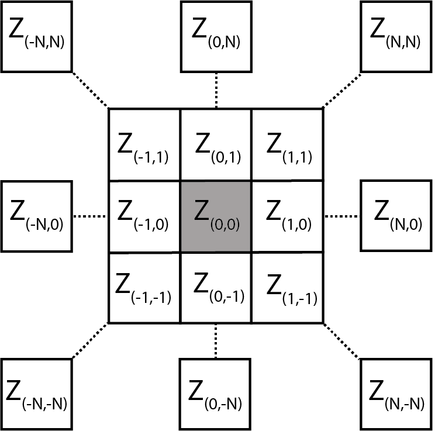
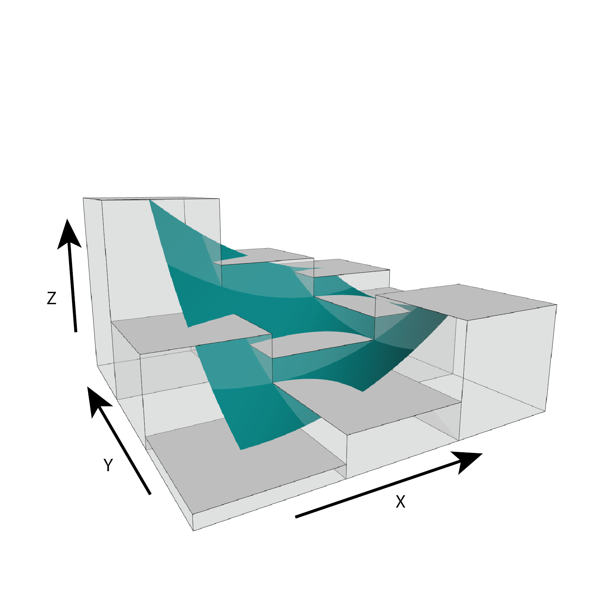

# MultiscaleDTM

[](https://zenodo.org/badge/latestdoi/353158828)


Please cite as

Ilich, Alexander R.; Misiuk, Benjamin; Lecours, Vincent; Murawski, Steven A.; 2021. “MultiscaleDTM”, doi:10.5281/zenodo.5548338. https://github.com/ailich/MultiscaleDTM.


```{r setup, include=FALSE}
knitr::opts_chunk$set(echo = TRUE, warning = FALSE, message = FALSE) #Default chunk options
```

## Purpose

This package calculates multi-scale geomorphometric terrain attributes from regularly gridded digital terrain models (DTM; i.e. elevation or bathymetry rasters) via a specified window size.



Figure adapted from Wilson et al. (2007)

## Install and Load Package
If you don't already have remotes installed, use the code `install.packages("remotes")`

Then to install this package use the code `remotes::install_github("ailich/MultiscaleDTM")` (If you are using Windows, you may need to install Rtools using the instructions found [here](https://cran.r-project.org/bin/windows/Rtools/)).

This package relies on the `terra` package for handling of spatial raster data. The CRAN version of `terra` may not have all necessary functions, so it is recommended to install the development version of `terra`. The easiest way to install the development version of `terra` on Windows or Mac is to use `install.packages('terra', repos='https://rspatial.r-universe.dev')`. For Linux, use `remotes::install_github("rspatial/terra")`. This package is also backwards compatible with the `raster` package. To install the development version of `raster` use `install.packages('raster', repos='https://rspatial.r-universe.dev')` on Windows or Mac or `remotes::install_github("rspatial/raster")` on Linux.

## Main Functions

### Slope, Aspect and Curvature

-   `SlpAsp` calculates multi-scale slope and aspect according to Misiuk et al (2021) which is a modification of the traditional 3 x 3 slope and aspect algorithms (Fleming and Hoffer, 1979; Horn et al., 1981; Ritter, 1987). This algorithm only considers a subset of cells within the focal window, specifically the four cells on the edge of the focal window directly up, down, left, and right of the focal cell for the "rook" case and an additional four corner cells for the "queen" case.


-   `Qfit` calculates slope, aspect, curvature, and morphometric features by fitting a quadratic surface to the focal window using ordinary least squares using the equation shown below where a-f are regression parameters Z is the elevation/depth, and X is the east/west coordinates in the focal window relative to the focal cell, and Y is the north/south coordinates in the focal window relative to the focal cell  (Evans, 1980; Wilson et al., 2007; Wood, 1996). The morphometric features algorithm has been modified to use more robust measures of curvature based on the suggestions of Minár et al. (2020).

$$
Z = aX^2 + bY^2 +cXY+ dX +eY +f
$$



### Rugosity

-   `VRM` - Vector ruggedness measure (Sappington et al. 2007) quantifies terrain ruggedness by measuring the dispersion of vectors orthogonal to the terrain surface. This is accomplished by calculating the local (3 x 3 cell) slope and aspect, and constructing unit vectors perpendicular to each cell in the DTM. These unit vectors are then decomposed into their corresponding x, y, and z components and used in the following equation (note: n is the number of cells in the window). VRM ranges from zero to one, where zero represents a smooth surface and one represents a "completely rugose" surface.

$$
\text{VRM} = 1- \frac{\sqrt{\bigg(\sum x\bigg)^2+\bigg(\sum y\bigg)^2+\bigg(\sum z\bigg)^2}}{n}
$$

$$
x = sin(\text{slope})*cos(\text{aspect})
$$

$$
y=sin(\text{slope})*cos(\text{aspect})
$$

$$
z=cos(\text{slope})
$$
-   `SAPA` - Calculates the Surface Area to Planar Area (Jenness, 2004). More rugose surfaces will have a greater surface area to planar area ratio, and perfectly smooth surfaces will have a value of 1. Additionally, planar area can be corrected for slope by dividing the product of the x and y resolution by the cosine of slope (Du Preez 2015). Additionally, a proposed extension to multiple scales is provided by summing the surface areas within the focal window and adjusting the planar area of the focal window using multi-scale slope.

    -   `SurfaceArea` - Calculate the surface area of each grid cell (Jenness, 2004). This is accomplished by connecting a focal cell to its immediate neighbors to create 8 large triangles. These large triangles are then trimmed back to the extent of the focal cell using the principle of similar triangles, and then the area of those 8 smaller triangles are calculated and summed to estimate the surface area of the focal pixel. This is used within `SAPA`.


Figure adapted from Jenness (2004)


-   `AdjSD`- This new proposed rugosity metric modifies the standard deviation of elevation/bathymetry to account for slope. It does this by first fitting a plane to the data in the focal window using ordinary least squares, and then extracting the residuals, and then calculating the standard deviation of the residuals within the focal window.


### Relative Position

-   `TPI` - Topographic Position Index (Weiss, 2001) is the difference between the value of a focal cell and the mean of the surrounding cells. 

-   `RDMV` - Relative Difference from Mean Value (Lecours et al., 2017) is the difference between the value of a focal cell and the mean of the cells in the focal window divided by the range or standard deviation of the values in the focal window. 

-   `BPI` -  Bathymetric Position Index (Lundblad et al., 2006) is the difference between the value of a focal cell and the mean of the surrounding cells contained within an annulus shaped window. It is a modification of TPI that uses an annulus shaped focal window and therefore requires an inner and outer radius. For example, an annulus window with an inner radius of 4 cells and an outer radius of 6 cells would be


## Tutorial

In this tutorial we will calculate various terrain attributes using a 5 x 5 cell rectangular window. Any rectangular odd numbered window size however could be used (see figure directly below). Window sizes are specified with a vector of length 2 of `c(n_rows, n_cols)`. If a single number is provided it will be used for both the number of rows and columns. The only metric that does not follow this syntax is BPI which uses an annulus shaped focal window which we will calculate using an inner radius of 4 and an outer radius of 6 cells.

**Load packages**

```{r message=FALSE}
library(MultiscaleDTM) #Load MultiscaleDTM package
```

**See package help page**

```{r eval=FALSE}
help(package="MultiscaleDTM")
```

**Read in Data**
```{r}
r<- rast(volcano, extent= ext(2667400, 2667400 + ncol(volcano)*10, 6478700, 6478700 + nrow(volcano)*10), crs = "EPSG:27200")
```

```{r echo= FALSE, message=FALSE}
library(tmap) #For plotting
tm_shape(r, raster.downsample = FALSE)+
  tm_raster(palette = colorRamps::matlab.like(100), style = "cont", legend.reverse = TRUE, title = "")+
  tm_layout(legend.outside=TRUE, main.title= "Elevation")
```

### Slope, Aspect, and Curvature

```{r}
slp_asp<- SlpAsp(r = r, w = c(5,5), unit = "degrees", method = "queen", metrics = c("slope", "aspect", "eastness", "northness"))
```

```{r echo=FALSE}
slp_asp_list<- vector(mode="list", length = nlyr(slp_asp))
for (i in 1:length(slp_asp_list)) {
  curr_var<- names(slp_asp)[i]
  
  if (grepl(pattern = "(^northness)|(^eastness)", curr_var)) {
    breaks<- c(-1,0,1)
    midpoint<- 0
    curr_pal<- c("blue", "gray", "red")
  } else if (grepl(pattern = "aspect", curr_var)) {
    curr_pal<-c("blue", "purple", "red", "orange", "yellow", "green", "cyan", "blue")
    breaks<- c(0,90,180,270,360)
    midpoint<- 180
  } else{
    curr_pal<- colorRamps::matlab.like(100)
    midpoint<- NULL
    breaks<- NULL
  }
  
  slp_asp_list[[i]]<- tm_shape(slp_asp[[i]], raster.downsample = FALSE) +
    tm_raster(palette = curr_pal, style= "cont", title = "", breaks = breaks, midpoint = midpoint, legend.reverse = TRUE)+
      tm_layout(main.title = curr_var, 
      main.title.position = "center",
      main.title.size=0.75)
  }
slp_asp_plot<- tmap_arrange(slp_asp_list, ncol=2)
slp_asp_plot
```

```{r}
qmetrics<- Qfit(r, w = c(5,5), unit = "degrees", metrics = c("elev", "qslope", "qaspect", "qeastness", "qnorthness", "profc", "planc", "twistc", "meanc", "maxc", "minc", "features"), na.rm = TRUE)
```

```{r echo= FALSE}
qmetrics_list<- vector(mode="list", length = nlyr(qmetrics))
for (i in 1:length(qmetrics_list)) {
  curr_var<- names(qmetrics)[i]
  
  if (grepl(pattern = "(northness)|(eastness)", curr_var)) {
    breaks<- c(-1,0,1)
    midpoint<- 0
    curr_pal<- c("blue", "gray", "red")
    style<- "cont"
  } else if (grepl(pattern = "aspect", curr_var)) {
    curr_pal<-c("blue", "purple", "red", "orange", "yellow", "green", "cyan", "blue")
    breaks<- c(0,90,180,270,360)
    midpoint<- 180
    style<- "cont"
    } else if(grepl(pattern = "^features", curr_var)) {
    curr_pal<- c("gray", "black", "blue", "green", "yellow", "red")
    midpoint<- NULL
    breaks<- NULL
    style<- "cat"
  } else if(grepl(pattern = "c$", curr_var)){
    curr_pal<- c("blue", "gray", "red")
    style<- "cont"
    breaks<- NULL
    midpoint<- 0
  } else{
    curr_pal<- colorRamps::matlab.like(100)
    midpoint<- NULL
    breaks<- NULL
    style<- "cont"}
  
  qmetrics_list[[i]]<- tm_shape(raster::raster(qmetrics[[i]]), raster.downsample = FALSE) +
    tm_raster(palette = curr_pal, style= style, title = "", breaks = breaks, midpoint = midpoint, legend.reverse = TRUE)+
      tm_layout(main.title = curr_var, 
      main.title.position = "center",
      main.title.size=0.75)
}
qmetrics_plot<- tmap_arrange(qmetrics_list, ncol=3)
qmetrics_plot
```

To explore these measures in an interactive environment use `explore_terrain()` or go to this [website](https://ailich.shinyapps.io/Terrain_Attributes_Explorer_App/)

### Rugosity

```{r}
vrm<- VRM(r, w=c(5,5), na.rm = TRUE)
```

```{r echo=FALSE}
tm_shape(vrm, raster.downsample = FALSE)+
  tm_raster(palette = colorRamps::matlab.like(100), style = "cont", legend.reverse = TRUE, title="")+
  tm_layout(legend.outside = TRUE, main.title="VRM")
```

Note: multi-scale SAPA is experimental. The established metric by De Preez (2015) would use `w=1`.
```{r}
sapa<- SAPA(r, w=c(5,5), slope_correction = TRUE)
```

```{r echo=FALSE}
tm_shape(sapa, raster.downsample = FALSE)+
  tm_raster(palette = colorRamps::matlab.like(100), style = "cont", legend.reverse = TRUE, title="")+
  tm_layout(legend.outside = TRUE, main.title="SAPA")
```

```{r}
adj_SD<- AdjSD(r, w=c(5,5), na.rm = TRUE)
```

```{r echo=FALSE}
tm_shape(adj_SD, raster.downsample = FALSE)+
  tm_raster(palette = colorRamps::matlab.like(100), style = "cont", legend.reverse = TRUE, title="")+
  tm_layout(legend.outside = TRUE, main.title="Adjusted SD")
```

### Relative Position
```{r}
tpi<- TPI(r, w=c(5,5), na.rm = TRUE)
```

```{r echo=FALSE}
tm_shape(tpi, raster.downsample = FALSE)+
  tm_raster(palette = c("blue", "gray", "red"), style = "cont", midpoint=0, legend.reverse = TRUE, title="")+
  tm_layout(legend.outside = TRUE, main.title="TPI")
```

```{r}
rdmv<- RDMV(r, w=c(5,5), na.rm = TRUE, method="range")
```

```{r echo=FALSE}
tm_shape(rdmv, raster.downsample = FALSE)+
  tm_raster(palette = c("blue", "gray", "red"), style = "cont", midpoint=0, legend.reverse = TRUE, title="")+
  tm_layout(legend.outside = TRUE, main.title="RDMV")
```

```{r}
bpi<- BPI(r, radius = c(4,6), unit = "cell", na.rm = TRUE)
```

```{r echo=FALSE}
tm_shape(bpi, raster.downsample = FALSE)+
  tm_raster(palette = c("blue", "gray", "red"), style = "cont", midpoint=0, legend.reverse = TRUE, title="")+
  tm_layout(legend.outside = TRUE, main.title="BPI")
```

The annulus window for BPI can be specified in either cell units (number of raster cells) or in map units (e.g. meters) which can be useful if your x and y resolutions are not equal. Additionally, the function `annulus_window` can be used to verify that you are specifying your window correctly (NA's are excluded cells and 1's are included cells) and can be directly supplied to the `w` argument in the `BPI` funtion instead of using `radius` and `unit` arguments.

```{r}
annulus_window(radius = c(4,6), unit = "cell")
```


# References

Du Preez, C., 2015. A new arc–chord ratio (ACR) rugosity index for quantifying three-dimensional landscape structural complexity. Landscape Ecol 30, 181–192. https://doi.org/10.1007/s10980-014-0118-8

Evans, I.S., 1980. An integrated system of terrain analysis and slope mapping. Zeitschrift f¨ur Geomorphologic Suppl-Bd 36, 274–295.

Fleming, M.D., Hoffer, R.M., 1979. Machine processing of landsat MSS data and DMA topographic data for forest cover type mapping (No. LARS Technical Report 062879). Laboratory for Applications of Remote Sensing, Purdue University, West Lafayette, Indiana.

Horn, B.K., 1981. Hill Shading and the Reflectance Map. Proceedings of the IEEE 69, 14–47.

Jenness, J.S., 2004. Calculating landscape surface area from digital elevation models. Wildlife Society Bulletin 32, 829–839. https://doi.org/10.2193/0091-7648(2004)032[0829:CLSAFD]2.0.CO;2

Lecours, V., Devillers, R., Simms, A.E., Lucieer, V.L., Brown, C.J., 2017. Towards a Framework for Terrain Attribute Selection in Environmental Studies. Environmental Modelling & Software 89, 19–30. https://doi.org/10.1016/j.envsoft.2016.11.027

Lundblad, E.R., Wright, D.J., Miller, J., Larkin, E.M., Rinehart, R., Naar, D.F., Donahue, B.T., Anderson, S.M., Battista, T., 2006. A benthic terrain classification scheme for American Samoa. Marine Geodesy 29, 89–111.

Minár, J., Evans, I.S., Jenčo, M., 2020. A comprehensive system of definitions of land surface (topographic) curvatures, with implications for their application in geoscience modelling and prediction. Earth-Science Reviews 211, 103414. https://doi.org/10.1016/j.earscirev.2020.103414

Misiuk, B., Lecours, V., Dolan, M.F.J., Robert, K., 2021. Evaluating the Suitability of Multi-Scale Terrain Attribute Calculation Approaches for Seabed Mapping Applications. Marine Geodesy 44, 327–385. https://doi.org/10.1080/01490419.2021.1925789

Ritter, P., 1987. A vector-based slope and aspect generation algorithm. Photogrammetric Engineering and Remote Sensing 53, 1109–1111.

Sappington, J.M., Longshore, K.M., Thompson, D.B., 2007. Quantifying Landscape Ruggedness for Animal Habitat Analysis: A Case Study Using Bighorn Sheep in the Mojave Desert. The Journal of Wildlife Management 71, 1419–1426. https://doi.org/10.2193/2005-723

Weiss, A., 2001. Topographic Position and Landforms Analysis. Presented at the ESRI user conference, San Diego, CA.

Wilson, M.F., O’Connell, B., Brown, C., Guinan, J.C., Grehan, A.J., 2007. Multiscale Terrain Analysis of Multibeam Bathymetry Data for Habitat Mapping on the Continental Slope. Marine Geodesy 30, 3-35. https://doi.org/10.1080/01490410701295962

Wood, J., 1996. The geomorphological characterisation of digital elevation models (Ph.D.). University of Leicester.


