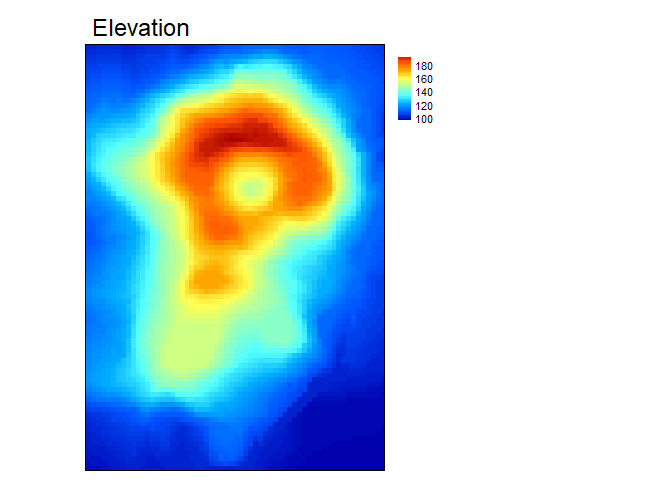
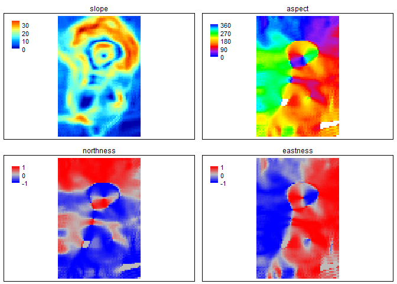
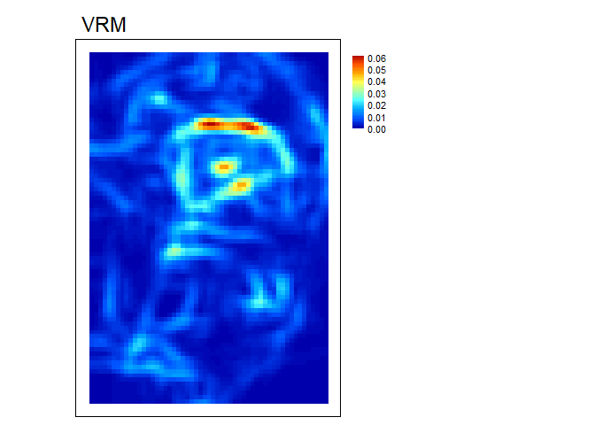
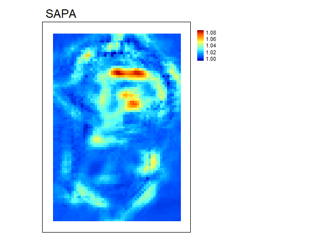
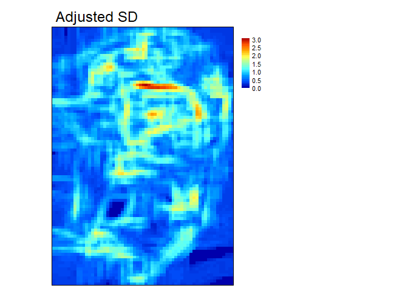
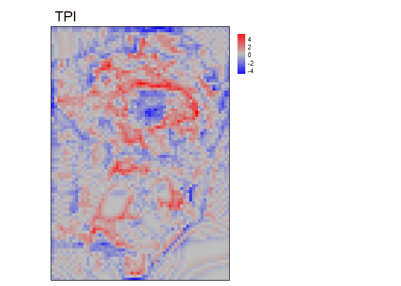
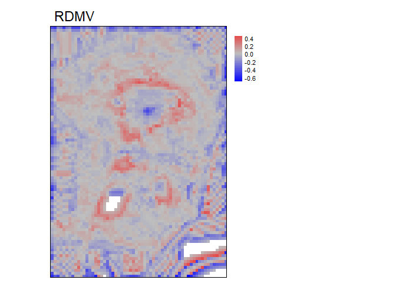
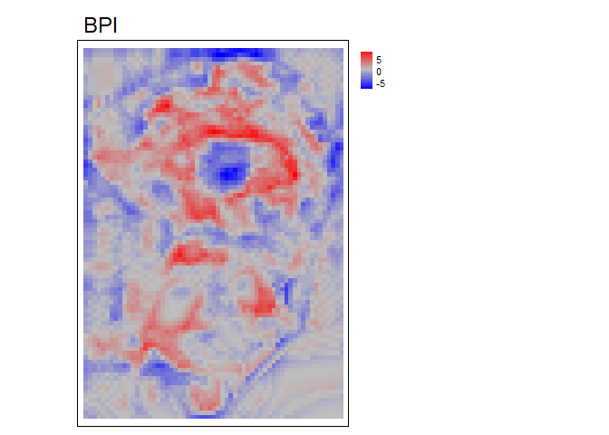

README
================
Alexander Ilich
January 12, 2022

# MultiscaleDEM

## THIS IS A PRE-RELEASE. IT IS STILL BEING TESTED AND FUNCTIONS MAY RECEIVE MAJOR CHANGES.

[](https://zenodo.org/badge/latestdoi/353158828)

Please cite as

Ilich, Alexander R.; Misiuk, Benjamin; Lecours, Vincent; Murawski,
Steven A.; 2021. “MultiscaleDEM”, <doi:10.5281/zenodo.5548338>.
<https://github.com/ailich/MultiscaleDEM>.

## Purpose

This package calculates multi-scale geomorphometric terrain attributes
from regularly gridded DEM/bathymetry rasters.

## Install and Load Package

If you don’t already have remotes installed, use the code
`install.packages("remotes")`

Then to install this package use the code
`remotes::install_github("ailich/MultiscaleDEM")` (you may need to
install Rtools using the instructions found
[here](https://cran.r-project.org/bin/windows/Rtools/).

This package relies on the `terra` package for handling of spatial
raster data. To install the development version of `terra`, use
`install.packages('terra', repos='https://rspatial.r-universe.dev')`.
This package is also backwards compatible with the `raster` package. To
install the development version of `raster` use
`install.packages('raster', repos='https://rspatial.r-universe.dev')`

## Main Functions

### Slope, Aspect and Curvature

-   `SlpAsp` calculates multi-scale slope and aspect according to Misiuk
    et al (2021) which is a modification of the traditional 3 x 3 slope
    and aspect algorithms (Fleming and Hoffer, 1979; Horn et al., 1981;
    Ritter, 1987).

-   `Qfit` calculates slope, aspect, curvature, and morphometric
    features by fitting a quadratic surface to the focal window using
    ordinary least squares (Evans, 1980; Wilson et al., 2007; Wood,
    1996). The morphometric features algorithm has been modified to use
    more robust measures of curvature based on the suggestions of Minár
    et al. (2020).

### Rugosity

-   `VRM` - Vector ruggedness measure (Sappington et al. 2007)
    quantifies terrain ruggedness by measuring the dispersion of vectors
    orthogonal to the terrain surface.

-   `SAPA` - Calculates the Surface Area to Planar Area (Jenness, 2004).
    Additionally, planar area can be corrected for slope (Du Preez
    2015). Additionally, a proposed extension to multiple scales is
    provided by summing the surface areas within the focal window and
    adjusting the planar area of the focal window using multi-scale
    slope.

    -   `SurfaceArea` - Calculate the surface area of each grid cell
        (Jenness, 2004). Used within `SAPA`.

-   `AdjSD`- This new proposed rugosity metric modifies the standard
    deviation of elevation/bathymetry to account for slope. It does this
    by first fitting a plane to the data in the focal window using
    ordinary least squares, and then extracting the residuals, and then
    calculating the standard deviation of the residuals.


### Relative Position

-   `TPI` - Topographic Position Index (Weiss, 2001) is the difference
    between the value of a focal cell and the mean of the surrounding
    cells.

-   `RDMV` - Relative Difference from Mean Value (Lecours et al., 2017)
    is the difference between the value of a focal cell and the mean of
    the cells in the focal window divided by the range or standard
    deviation of the values in the focal window.

-   `BPI` - Bathymetric Position Index (Lundblad et al., 2006) is the
    difference between the value of a focal cell and the mean of the
    surrounding cells contained within an annulus shaped window.

## Tutorial

In this tutorial we will calculate various terrain attributes using a 5
x 5 cell rectangular window. Any rectangular odd numbered window size
however could be used. Window sizes are specified with a vector of
length 2 of `c(n_rows, n_cols)`. If a single number is provided it will
be used for both the number of rows and columns. The only metric that
does not follow this syntax is BPI which uses an annulus shaped focal
window which we will calculate using an inner radius of 2 and an outer
radius of 4 cells.

**Load packages**

``` r
library(terra) #Load terra package for handling of raster data
library(MultiscaleDEM) #Load MultiscaleDEM package
```

**See package help page**

``` r
help(package="MultiscaleDEM")
```

**Read in Data**

``` r
r<- rast(volcano, extent= ext(2667400, 2667400 + ncol(volcano)*10, 6478700, 6478700 + nrow(volcano)*10), crs = "EPSG:27200")
```

<!-- -->

### Slope, Aspect, and Curvature

``` r
slp_asp<- SlpAsp(r = r, w = c(5,5), unit = "degrees", method = "queen", metrics = c("slope", "aspect", "eastness", "northness"))
```

<!-- -->

``` r
qmetrics<- Qfit(r, w = c(5,5), unit = "degrees", metrics = c("elev", "qslope", "qaspect", "qeastness", "qnorthness", "profc", "planc", "twistc", "meanc", "maxc", "minc", "features"), na.rm = TRUE)
```

<!-- -->

To explore these measures in an interactive environment use
`explore_terrain()` or go to this
[website](https://ailich.shinyapps.io/Terrain_Attributes_Explorer_App/)

### Rugosity

``` r
vrm<- VRM(r, w=c(5,5), na.rm = TRUE)
```

<!-- -->

Note: multi-scale SAPA is experimental. The established metric by De
Preez (2015) would use `w=1`.

``` r
sapa<- SAPA(r, w=c(5,5), slope_correction = TRUE)
```

<!-- -->

``` r
adj_SD<- AdjSD(r, w=c(5,5), na.rm = TRUE)
```

<!-- -->

### Relative Position

``` r
tpi<- TPI(r, w=c(5,5), na.rm = TRUE)
```

<!-- -->

``` r
rdmv<- RDMV(r, w=c(5,5), na.rm = TRUE, method="range")
```

<!-- -->

``` r
bpi<- BPI(r, radius = c(2,4), unit = "cell", na.rm = TRUE)
```

<!-- -->

BPI is a modification of TPI that uses an annulus shaped focal window
and therefore requires an inner and outer radius. This can be specified
in cell units (number of raster cells) or in map units (e.g. meters)
which can be useful if your x and y resolutions are not equal. For
example, an annulus window with an inner radius of 2 cells and an outer
radius of 4 cells would be

``` r
annulus_window(radius = c(2,4), unit = "cell")
```

    ##       [,1] [,2] [,3] [,4] [,5] [,6] [,7] [,8] [,9]
    ##  [1,]   NA   NA   NA   NA    1   NA   NA   NA   NA
    ##  [2,]   NA   NA    1    1    1    1    1   NA   NA
    ##  [3,]   NA    1    1    1    1    1    1    1   NA
    ##  [4,]   NA    1    1   NA   NA   NA    1    1   NA
    ##  [5,]    1    1    1   NA   NA   NA    1    1    1
    ##  [6,]   NA    1    1   NA   NA   NA    1    1   NA
    ##  [7,]   NA    1    1    1    1    1    1    1   NA
    ##  [8,]   NA   NA    1    1    1    1    1   NA   NA
    ##  [9,]   NA   NA   NA   NA    1   NA   NA   NA   NA

# References

Du Preez, C., 2015. A new arc–chord ratio (ACR) rugosity index for
quantifying three-dimensional landscape structural complexity. Landscape
Ecol 30, 181–192. <https://doi.org/10.1007/s10980-014-0118-8>

Evans, I.S., 1980. An integrated system of terrain analysis and slope
mapping. Zeitschrift f¨ur Geomorphologic Suppl-Bd 36, 274–295.

Fleming, M.D., Hoffer, R.M., 1979. Machine processing of landsat MSS
data and DMA topographic data for forest cover type mapping (No. LARS
Technical Report 062879). Laboratory for Applications of Remote Sensing,
Purdue University, West Lafayette, Indiana.

Horn, B.K., 1981. Hill Shading and the Reflectance Map. Proceedings of
the IEEE 69, 14–47.

Jenness, J.S., 2004. Calculating landscape surface area from digital
elevation models. Wildlife Society Bulletin 32, 829–839.
<https://doi.org/10.2193/0091-7648(2004)032%5B0829:CLSAFD%5D2.0.CO;2>

Lecours, V., Devillers, R., Simms, A.E., Lucieer, V.L., Brown, C.J.,
2017. Towards a Framework for Terrain Attribute Selection in
Environmental Studies. Environmental Modelling & Software 89, 19–30.
<https://doi.org/10.1016/j.envsoft.2016.11.027>

Lundblad, E.R., Wright, D.J., Miller, J., Larkin, E.M., Rinehart, R.,
Naar, D.F., Donahue, B.T., Anderson, S.M., Battista, T., 2006. A benthic
terrain classification scheme for American Samoa. Marine Geodesy 29,
89–111.

Minár, J., Evans, I.S., Jenčo, M., 2020. A comprehensive system of
definitions of land surface (topographic) curvatures, with implications
for their application in geoscience modelling and prediction.
Earth-Science Reviews 211, 103414.
<https://doi.org/10.1016/j.earscirev.2020.103414>

Misiuk, B., Lecours, V., Dolan, M.F.J., Robert, K., 2021. Evaluating the
Suitability of Multi-Scale Terrain Attribute Calculation Approaches for
Seabed Mapping Applications. Marine Geodesy 44, 327–385.
<https://doi.org/10.1080/01490419.2021.1925789>

Ritter, P., 1987. A vector-based slope and aspect generation algorithm.
Photogrammetric Engineering and Remote Sensing 53, 1109–1111.

Sappington, J.M., Longshore, K.M., Thompson, D.B., 2007. Quantifying
Landscape Ruggedness for Animal Habitat Analysis: A Case Study Using
Bighorn Sheep in the Mojave Desert. The Journal of Wildlife Management
71, 1419–1426. <https://doi.org/10.2193/2005-723>

Weiss, A., 2001. Topographic Position and Landforms Analysis. Presented
at the ESRI user conference, San Diego, CA.

Wilson, M.F., O’Connell, B., Brown, C., Guinan, J.C., Grehan, A.J.,
2007. Multiscale Terrain Analysis of Multibeam Bathymetry Data for
Habitat Mapping on the Continental Slope. Marine Geodesy 30, 3-35.
<https://doi.org/10.1080/01490410701295962>

Wood, J., 1996. The geomorphological characterisation of digital
elevation models (Ph.D.). University of Leicester.
