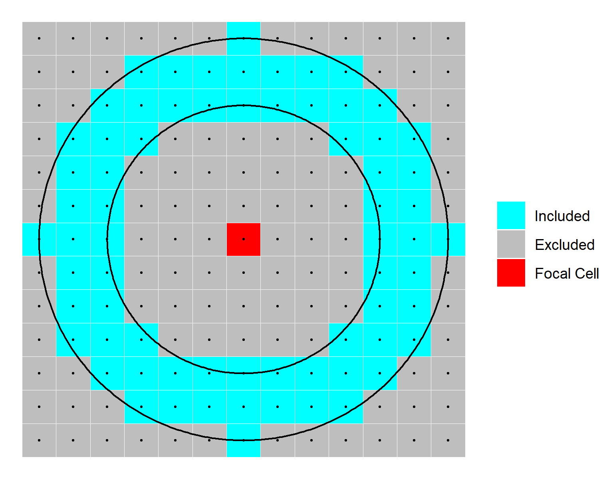
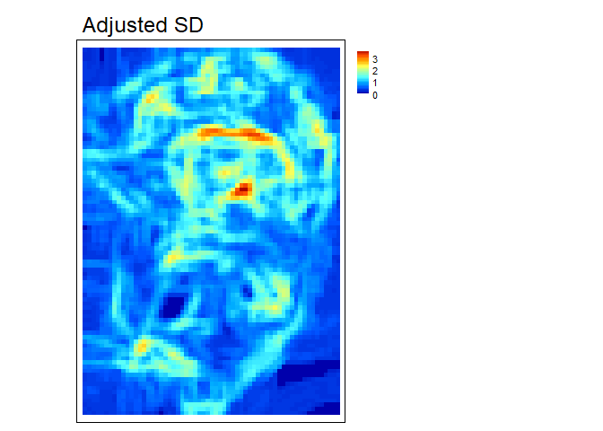
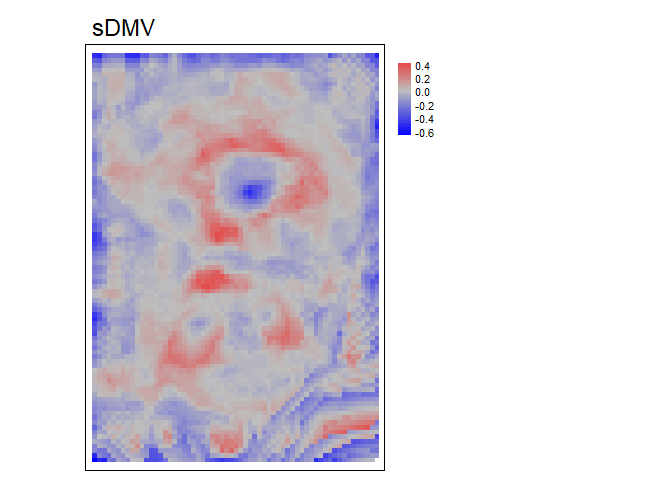

README
================
Alexander Ilich
October 04, 2022

# MultiscaleDTM

<!-- badges: start -->

[](https://github.com/ailich/MultiscaleDTM/actions/workflows/R-CMD-check.yaml)

[](https://zenodo.org/badge/latestdoi/353158828)
<!-- badges: end -->

Please cite as

Ilich, Alexander R.; Misiuk, Benjamin; Lecours, Vincent; Murawski,
Steven A.; 2021. “MultiscaleDTM”,
<https://doi.org/10.5281/zenodo.5548338>.
<https://github.com/ailich/MultiscaleDTM>.

## Purpose

This package calculates multi-scale geomorphometric terrain attributes
from regularly gridded digital terrain models (DTM; i.e. elevation or
bathymetry rasters) via a specified window size.


Figure adapted from Wilson et al. (2007)

## Install and Load Package

The package can be installed from CRAN using
`install.packages("MultiscaleDTM")` or the development version can be
installed from github using the code
`remotes::install_github("ailich/MultiscaleDTM")`. If you are using
Windows, you may need to install Rtools using the instructions found
[here](https://cran.r-project.org/bin/windows/Rtools/)). To install from
github you must already have the remotes package installed, which can be
installed using `install.packages("remotes")`

This package relies on the `terra` package for handling of spatial
raster data.

## Main Functions

### Slope, Aspect and Curvature

-   `SlpAsp` calculates multi-scale slope and aspect according to Misiuk
    et al (2021) which is a modification of the traditional 3 x 3 slope
    and aspect algorithms (Fleming and Hoffer, 1979; Horn et al., 1981;
    Ritter, 1987). This algorithm only considers a subset of cells
    within the focal window, specifically the four cells on the edge of
    the focal window directly up, down, left, and right of the focal
    cell for the “rook” case and an additional four corner cells for the
    “queen” case. 

-   `Qfit` calculates slope, aspect, curvature, and morphometric
    features by fitting a quadratic surface to the focal window using
    ordinary least squares using the equation shown below where a-f are
    regression parameters, Z is the elevation/depth, X is the east/west
    coordinates in the focal window relative to the focal cell, and Y is
    the north/south coordinates in the focal window relative to the
    focal cell (Evans, 1980; Wilson et al., 2007; Wood, 1996). The
    morphometric features algorithm has been modified to use more robust
    measures of curvature based on the suggestions of Minár et
    al. (2020).


Figure adapted from Walbridge et al., (2018)

### Rugosity

-   `VRM` - Vector ruggedness measure (Sappington et al. 2007)
    quantifies terrain ruggedness by measuring the dispersion of vectors
    normal to the terrain surface. This is accomplished by calculating
    the local (3 x 3 cell) slope and aspect, and constructing unit
    vectors normal to each cell in the DTM. These unit vectors are then
    decomposed into their corresponding x, y, and z components (i.e. the
    x, y, and z coordinates of the head of the vector relative to its
    origin) and used in the following equation (note: n is the number of
    cells in the window). VRM ranges from zero to one, representing
    completely smooth to rugose surfaces, respectively. .


Figure adapted from Sappington et al. (2007)


Figure adapted from Habib (2021)

^2+\bigg(\sum y\bigg)^2+\bigg(\sum z\bigg)^2}}{n}")

*cos(\text{aspect})")

*cos(\text{aspect})")

")

 - `SAPA` - Calculates the Surface Area to Planar Area (Jenness, 2004).
More rugose surfaces will have a greater surface area to planar area
ratio, and perfectly smooth surfaces will have a value of 1. This is a
3D analog to the classical “chain-and-tape” method, which calculates
rugosity as the ratio of the contoured distance (chain length) and
linear distance (tape measure distance; Risk, 1972). Additionally,
planar area can be corrected for slope by dividing the product of the x
and y resolution by the cosine of slope (Du Preez 2015). Moreover, a
proposed extension to multiple scales is provided by summing the surface
areas within the focal window and adjusting the planar area of the focal
window using multi-scale slope.

    - `SurfaceArea` - Calculate the surface area of each grid cell (Jenness, 2004). This is accomplished by connecting a focal cell to its immediate neighbors to create 8 large triangles. These large triangles are then trimmed back to the extent of the focal cell using the principle of similar triangles, and then the area of those 8 smaller triangles are calculated and summed to estimate the surface area of the focal pixel. This is used within `SAPA`.


Figure adapted from Friedman et al. (2012) and created with
BioRender.com.


Figure adapted from Jenness (2004)

-   `AdjSD`- This new proposed rugosity metric modifies the standard
    deviation of elevation/bathymetry to account for slope. It does this
    by first fitting a plane to the data in the focal window using
    ordinary least squares, and then extracting the residuals, and then
    calculating the standard deviation of the residuals within the focal
    window.


-   `RIE` - Calculates the Roughness Index-Elevation which quantifies
    the standard deviation of residual topography (Cavalli et al.,
    2008). This measure is conceptually similar to `AdjSD` but rather
    than fitting a plane and extracting residuals for the entire focal
    window, residual topography is calculated as the focal pixel minus
    the focal mean. Then the local standard deviation is calculated from
    this residual topography using a focal filter.


Figure adapted from Cavalli et al. (2008)

### Relative Position

-   `TPI` - Topographic Position Index (Weiss, 2001) is the difference
    between the value of a focal cell and the mean of the surrounding
    cells.

-   `RDMV` - Relative Difference from Mean Value (Lecours et al., 2017)
    is the difference between the value of a focal cell and the mean of
    the cells in the focal window divided by the range or standard
    deviation of the values in the focal window.

-   `BPI` - Bathymetric Position Index (Lundblad et al., 2006) is the
    difference between the value of a focal cell and the mean of the
    surrounding cells contained within an annulus shaped window. It is a
    modification of TPI that uses an annulus shaped focal window and
    therefore requires an inner and outer radius. For example, an
    annulus window with an inner radius of 4 cells and an outer radius
    of 6 cells would be



Figure adapted from Lundblad et al., (2006)

## Tutorial

In this tutorial we will calculate various terrain attributes using a 5
x 5 cell rectangular window. Any rectangular odd numbered window size
however could be used (see figure directly below). Window sizes are
specified with a vector of length 2 of `c(n_rows, n_cols)`. If a single
number is provided it will be used for both the number of rows and
columns. The only metric that does not follow this syntax is BPI which
uses an annulus shaped focal window which we will calculate using an
inner radius of 4 and an outer radius of 6 cells.

**Load packages**

``` r
library(MultiscaleDTM) #Load MultiscaleDTM package
```

**See package help page**

``` r
help(package="MultiscaleDTM")
```

**Read in Data**

``` r
r<- rast(volcano, extent= ext(2667400, 2667400 + ncol(volcano)*10, 6478700, 6478700 + nrow(volcano)*10), crs = "EPSG:27200")
```

<!-- -->

### Slope, Aspect, and Curvature

``` r
slp_asp<- SlpAsp(r = r, w = c(5,5), unit = "degrees", method = "queen", metrics = c("slope", "aspect", "eastness", "northness"))
```

<!-- -->

``` r
qmetrics<- Qfit(r, w = c(5,5), unit = "degrees", metrics = c("elev", "qslope", "qaspect", "qeastness", "qnorthness", "profc", "planc", "twistc", "meanc", "maxc", "minc", "features"), na.rm = TRUE)
```

<!-- -->

To explore these measures in an interactive environment use
`explore_terrain()` or go to this
[website](https://ailich.shinyapps.io/Terrain_Attributes_Explorer_App/)

### Rugosity

``` r
vrm<- VRM(r, w=c(5,5), na.rm = TRUE)
```

<!-- -->

Note: multi-scale SAPA is experimental. The established metric by De
Preez (2015) would use `w=1`.

``` r
sapa<- SAPA(r, w=c(5,5), slope_correction = TRUE)
```

<!-- -->

``` r
adj_SD<- AdjSD(r, w=c(5,5), na.rm = TRUE)
```

<!-- -->

``` r
rie<- RIE(r, w=c(5,5), na.rm = TRUE)
```

<!-- -->

### Relative Position

``` r
tpi<- TPI(r, w=c(5,5), na.rm = TRUE)
```

<!-- -->

``` r
rdmv<- RDMV(r, w=c(5,5), na.rm = TRUE, method="range")
```

<!-- -->

``` r
bpi<- BPI(r, radius = c(4,6), unit = "cell", na.rm = TRUE)
```

<!-- -->

The annulus window for BPI can be specified in either cell units (number
of raster cells) or in map units (e.g. meters) which can be useful if
your x and y resolutions are not equal. Additionally, the function
`annulus_window` can be used to verify that you are specifying your
window correctly (NA’s are excluded cells and 1’s are included cells)
and can be directly supplied to the `w` argument in the `BPI` funtion
instead of using `radius` and `unit` arguments.

``` r
annulus_window(radius = c(4,6), unit = "cell")
```

    ##       [,1] [,2] [,3] [,4] [,5] [,6] [,7] [,8] [,9] [,10] [,11] [,12] [,13]
    ##  [1,]   NA   NA   NA   NA   NA   NA    1   NA   NA    NA    NA    NA    NA
    ##  [2,]   NA   NA   NA    1    1    1    1    1    1     1    NA    NA    NA
    ##  [3,]   NA   NA    1    1    1    1    1    1    1     1     1    NA    NA
    ##  [4,]   NA    1    1    1   NA   NA   NA   NA   NA     1     1     1    NA
    ##  [5,]   NA    1    1   NA   NA   NA   NA   NA   NA    NA     1     1    NA
    ##  [6,]   NA    1    1   NA   NA   NA   NA   NA   NA    NA     1     1    NA
    ##  [7,]    1    1    1   NA   NA   NA   NA   NA   NA    NA     1     1     1
    ##  [8,]   NA    1    1   NA   NA   NA   NA   NA   NA    NA     1     1    NA
    ##  [9,]   NA    1    1   NA   NA   NA   NA   NA   NA    NA     1     1    NA
    ## [10,]   NA    1    1    1   NA   NA   NA   NA   NA     1     1     1    NA
    ## [11,]   NA   NA    1    1    1    1    1    1    1     1     1    NA    NA
    ## [12,]   NA   NA   NA    1    1    1    1    1    1     1    NA    NA    NA
    ## [13,]   NA   NA   NA   NA   NA   NA    1   NA   NA    NA    NA    NA    NA

# References

Cavalli, M., Tarolli, P., Marchi, L., Dalla Fontana, G., 2008. The
effectiveness of airborne LiDAR data in the recognition of channel-bed
morphology. CATENA 73, 249–260.
<https://doi.org/10.1016/j.catena.2007.11.001>

Du Preez, C., 2015. A new arc–chord ratio (ACR) rugosity index for
quantifying three-dimensional landscape structural complexity. Landscape
Ecol 30, 181–192. <https://doi.org/10.1007/s10980-014-0118-8>

Evans, I.S., 1980. An integrated system of terrain analysis and slope
mapping. Zeitschrift f¨ur Geomorphologic Suppl-Bd 36, 274–295.

Fleming, M.D., Hoffer, R.M., 1979. Machine processing of landsat MSS
data and DMA topographic data for forest cover type mapping (No. LARS
Technical Report 062879). Laboratory for Applications of Remote Sensing,
Purdue University, West Lafayette, Indiana.

Friedman, A., Pizarro, O., Williams, S.B., Johnson-Roberson, M., 2012.
Multi-Scale Measures of Rugosity, Slope and Aspect from Benthic Stereo
Image Reconstructions. PLOS ONE 7, e50440.
<https://doi.org/10.1371/journal.pone.0050440>

Habib, M., 2021. Quantifying Topographic Ruggedness Using Principal
Component Analysis. Advances in Civil Engineering 2021, e3311912.
<https://doi.org/10.1155/2021/3311912>

Horn, B.K., 1981. Hill Shading and the Reflectance Map. Proceedings of
the IEEE 69, 14–47.

Jenness, J.S., 2004. Calculating landscape surface area from digital
elevation models. Wildlife Society Bulletin 32, 829–839.
<https://doi.org/10.2193/0091-7648(2004)032%5B0829:CLSAFD%5D2.0.CO;2>

Lecours, V., Devillers, R., Simms, A.E., Lucieer, V.L., Brown, C.J.,
2017. Towards a Framework for Terrain Attribute Selection in
Environmental Studies. Environmental Modelling & Software 89, 19–30.
<https://doi.org/10.1016/j.envsoft.2016.11.027>

Lundblad, E.R., Wright, D.J., Miller, J., Larkin, E.M., Rinehart, R.,
Naar, D.F., Donahue, B.T., Anderson, S.M., Battista, T., 2006. A benthic
terrain classification scheme for American Samoa. Marine Geodesy 29,
89–111. <https://doi.org/10.1080/01490410600738021>

Minár, J., Evans, I.S., Jenčo, M., 2020. A comprehensive system of
definitions of land surface (topographic) curvatures, with implications
for their application in geoscience modelling and prediction.
Earth-Science Reviews 211, 103414.
<https://doi.org/10.1016/j.earscirev.2020.103414>

Misiuk, B., Lecours, V., Dolan, M.F.J., Robert, K., 2021. Evaluating the
Suitability of Multi-Scale Terrain Attribute Calculation Approaches for
Seabed Mapping Applications. Marine Geodesy 44, 327–385.
<https://doi.org/10.1080/01490419.2021.1925789>

Risk, M.J., 1972. Fish Diversity on a Coral Reef in the Virgin Islands.
Atoll Research Bulletin 153, 1–4.
<https://doi.org/10.5479/si.00775630.153.1>

Ritter, P., 1987. A vector-based slope and aspect generation algorithm.
Photogrammetric Engineering and Remote Sensing 53, 1109–1111.

Sappington, J.M., Longshore, K.M., Thompson, D.B., 2007. Quantifying
Landscape Ruggedness for Animal Habitat Analysis: A Case Study Using
Bighorn Sheep in the Mojave Desert. The Journal of Wildlife Management
71, 1419–1426. <https://doi.org/10.2193/2005-723>

Walbridge, S., Slocum, N., Pobuda, M., Wright, D.J., 2018. Unified
geomorphological analysis workflows with benthic terrain modeler.
Geosciences 8, 94. <https://doi.org/10.3390/geosciences8030094>

Weiss, A., 2001. Topographic Position and Landforms Analysis. Presented
at the ESRI user conference, San Diego, CA.

Wilson, M.F., O’Connell, B., Brown, C., Guinan, J.C., Grehan, A.J.,
2007. Multiscale Terrain Analysis of Multibeam Bathymetry Data for
Habitat Mapping on the Continental Slope. Marine Geodesy 30, 3-35.
<https://doi.org/10.1080/01490410701295962>

Wood, J., 1996. The geomorphological characterisation of digital
elevation models (Ph.D.). University of Leicester.
